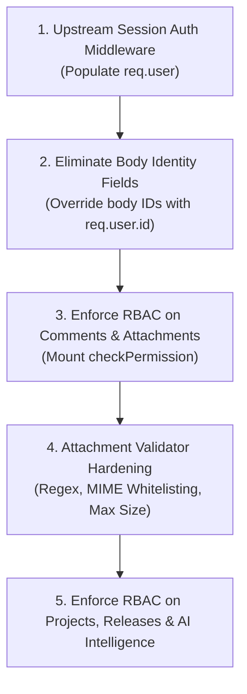

# NEXUS API Security Coverage Audit (Raven Phase 4A)

This document presents a comprehensive security coverage audit of all API endpoints exposed by Scarlet's Express backend. It identifies authorization enforcement, client-controlled identity parameters, validation gaps, and the recommended Phase 4B implementation order.

---

## 1. Endpoint Security Coverage Matrix

| Route Endpoint | HTTP Method | Expected RBAC Action / Resource | Currently Enforced? | Client-Controlled Identity Fields | Input-Validation / Security Concerns | Authentication Blocked? |
| :--- | :--- | :--- | :--- | :--- | :--- | :--- |
| `/api/projects` | `GET` | `read` / `project` | **NO** | None | Returns all projects anonymously. | Yes |
| `/api/projects` | `POST` | `create` / `project` | **NO** | None | Anyone can create projects anonymously. | Yes |
| `/api/projects/:id` | `GET` | `read` / `project` | **NO** | None | Anyone can view any project anonymously. | Yes |
| `/api/releases` | `GET` | `read` / `release` | **NO** | None | Anyone can list releases anonymously. | Yes |
| `/api/releases` | `POST` | `create` / `release` | **NO** | None | Anyone can create releases anonymously. | Yes |
| `/api/releases/:id` | `GET` | `read` / `release` | **NO** | None | Anyone can view release details anonymously. | Yes |
| `/api/issues` | `GET` | `read` / `issue` | **YES** | None | Query filters are validated by local SQL check parameters. | No |
| `/api/issues` | `POST` | `create` / `issue` | **YES** | `reporterId` | `reporterId` is taken from client request body (spoofable). | Yes (enforcement depends on req.user) |
| `/api/issues/:id` | `GET` | `read` / `issue` | **YES** | None | Fetches issue details. | No |
| `/api/issues/:id` | `PATCH` | `update` / `issue` | **YES** | `assigneeId` (optional) | Update fields are verified, but assignee can be set to any user ID. | No |
| `/api/issues/:id` | `DELETE` | `delete` / `issue` | **YES** | None | Deletes issue from database. | No |
| `/api/issues/:id/status` | `PATCH` | `update` / `issue` | **YES** | `actorId` | `actorId` is taken from transition payload body (spoofable). | Yes (enforcement depends on req.user) |
| `/api/issues/:issueId/comments` | `GET` | `read` / `comment` | **NO** | None | Anyone can list comments on any issue anonymously. | Yes |
| `/api/issues/:issueId/comments` | `POST` | `create` / `comment` | **NO** | `authorId` | `authorId` is taken from request body (spoofable). | Yes |
| `/api/issues/:issueId/dependencies` | `GET` | `read` / `dependency` | **NO** | None | Dependency links can be viewed anonymously. | Yes |
| `/api/issues/:issueId/dependencies` | `POST` | `create` / `dependency` | **NO** | None | Dependencies can be linked anonymously. | Yes |
| `/api/issues/:issueId/dependencies/:targetId/:relation` | `DELETE` | `delete` / `dependency` | **NO** | None | Dependencies can be unlinked anonymously. | Yes |
| `/api/issues/:issueId/attachments` | `GET` | `read` / `attachment` | **NO** | None | File metadata can be listed anonymously. | Yes |
| `/api/issues/:issueId/attachments` | `POST` | `create` / `attachment` | **NO** | `uploadedBy` | Metadata creation is anonymous; `uploadedBy` is spoofable. Filename, MIME, and size validation gaps active. | Yes |
| `/api/issues/:id/analyze` | `POST` | `view_security_findings` / `issue` | **NO** | None | AI analysis triggers can be run anonymously. | Yes |
| `/api/issues/:id/intelligence` | `GET` | `view_security_findings` / `issue` | **NO** | None | AI results can be retrieved anonymously. | Yes |
| `/api/issues/:id/duplicates` | `GET` | `read` / `issue` | **NO** | None | Duplicate issue search runs anonymously. | Yes |
| `/api/issues/:id/related` | `GET` | `read` / `issue` | **NO** | None | Related issue analysis runs anonymously. | Yes |
| `/api/issues/:id/reproduction-capsule` | `GET` | `view_security_findings` / `issue` | **NO** | None | Reproduction details readable anonymously. | Yes |
| `/api/issues/:id/resolution-confidence` | `GET` | `read` / `issue` | **NO** | None | Resolution confidence score readable anonymously. | Yes |
| `/api/releases/:id/risk` | `GET` | `read` / `release` | **NO** | None | Release risk score readable anonymously. | Yes |

---

## 2. Security Findings

### A. Client-Controlled Identity / Audit Integrity Family
Across multiple routes, user context and logging variables are supplied directly within the JSON request body instead of resolving from a cryptographically verified session context:
1. **`issues` (`reporterId`, `actorId`)**:
   - `POST /api/issues` uses `reporterId` from the request body to assign the issue creator and log the `ISSUE_CREATED` audit event.
   - `PATCH /api/issues/:id/status` uses `actorId` from the transition payload body to record the status changer in the `STATUS_CHANGED` event log.
2. **`comments` (`authorId`)**:
   - `POST /api/issues/:issueId/comments` accepts `authorId` in the body payload, allowing an attacker to post messages impersonating any valid user.
3. **`attachments` (`uploadedBy`)**:
   - `POST /api/issues/:issueId/attachments` accepts `uploadedBy` in the body payload, enabling file uploads to be registered in other users' names.

**Vulnerability Classification**: `DEFINED / SECURITY FINDING / BLOCKED ON AUTHENTICATION INTEGRATION`.

---

### B. Attachment Metadata Validation Concerns
In `src/attachments/routes.ts`, file registration relies on raw client-supplied metadata parameters that are not verified against safety constraints:
1. **`fileName` Path Traversal**:
   - Zod allows any characters up to 255 characters (`z.string().trim().min(1).max(255)`). It does not filter out path separators (`/`, `\`) or traversal elements (`..`), which can cause local file inclusions/writes if combined with filesystem persistence.
2. **`contentType` Executable Content**:
   - Validates length only (`max(160)`). Any MIME-type (e.g. `application/x-sh`, `text/html`, `application/octet-stream`) is accepted. Dangerous script files could be registered, posing XSS and payload execution risks.
3. **`sizeBytes` Overflow**:
   - Simply checks for non-negative integers. No upper limit is enforced, allowing requests to claim arbitrarily large uploads (e.g. 100GB), corrupting quota data or causing resource starvation.
4. **`objectKey` Manipulation**:
   - Accepts any string up to 512 characters. An attacker can supply keys pointing to files outside their authorized project scope, corrupting file storage links.

---

## 3. Upstream Authentication Dependencies

All route authorization checks and identity spoofing mitigations are strictly blocked by the lack of an authentication mechanism:
- **Dependency**: Scarlet must implement a session verify middleware (resolving a secure HTTP-Only cookie or header JWT).
- **Execution**: The session verification middleware must populate `req.user` with `{ id: string, role: string }`.
- **Enforcement**: Once `req.user` is active, the router and controller levels must override client-supplied ID parameters (`reporterId`, `actorId`, `authorId`, `uploadedBy`) with `req.user.id`, ensuring audit logs are cryptographically tied to the authenticated principal.

---

## 4. Recommended Phase 4B Implementation Order

Once Scarlet implements the upstream authentication session middleware, the following order is recommended to achieve full security coverage:

1. **Step 1: Session Integration**: scarlet mounts the session checker on `/api/*`, setting `req.user`.
2. **Step 2: Remove Body ID Overrides**: Replace body identity fields with `req.user.id` in `createIssue`, `transitionIssue`, comment posts, and attachment uploads.
3. **Step 3: Enforce RBAC on Sub-resources**: Mount `checkPermission` on comments and attachments.
4. **Step 4: Attachments Hardening**: Modify Zod validation schemas in `attachments/routes.ts` to enforce regex filename traversals checks, maximum size limit (10MB), and MIME whitelist.
5. **Step 5: General RBAC Enforcements**: Mount `checkPermission` on projects, releases, and intelligence/AI routes.
